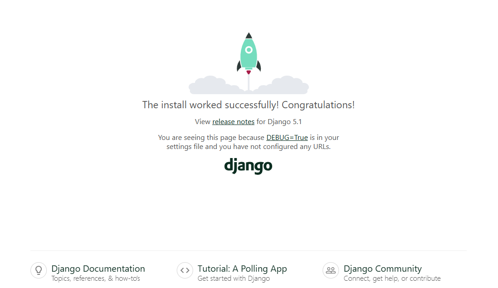

# Poetry

Poetry 是一個 Python 依賴和包管理工具，簡化了專案的依賴管理、虛擬環境和版本控制。  
這個專案展示如何在 Poetry 中建立虛擬環境，安裝 Django，並啟動一個簡單的 Django 開發伺服器。

## Overview

- 語言: Python 3.12.3
- 依賴管理: Poetry v1.8.3
- 網頁框架: Django v5.1.3


## Steps

### Initialize Poetry

要初始化一個新的 Poetry 專案，請執行以下命令：
```bash
poetry init
```

系統會提示你回答以下問題，根據提示來配置你的 `pyproject.toml` 文件：
```
This command will guide you through creating your pyproject.toml config.

Package name [poetry-python]: 
Version [0.1.0]: 
Description []: 
Author [yuhexiong <yuhexiong871210@gmail.com>, n to skip]: 
License []: 
Compatible Python versions [^3.12]: 

Would you like to define your main dependencies interactively? (yes/no) [yes] no
Would you like to define your development dependencies interactively? (yes/no) [yes]
PS C:\Users\ninaxiong\xiong\poetry-python> ^C
PS C:\Users\ninaxiong\xiong\poetry-python> ^C
PS C:\Users\ninaxiong\xiong\poetry-python> poetry init

This command will guide you through creating your pyproject.toml config.

Package name [poetry-python]: 
Version [0.1.0]:  
Description []:  
Author [yuhexiong <yuhexiong871210@gmail.com>, n to skip]:  
License []:  
Compatible Python versions [^3.12]:  

Would you like to define your main dependencies interactively? (yes/no) [yes] yes
You can specify a package in the following forms:
  - A single name (requests): this will search for matches on PyPI
  - A name and a constraint (requests@^2.23.0)
  - A git url (git+https://github.com/python-poetry/poetry.git)
  - A git url with a revision (git+https://github.com/python-poetry/poetry.git#develop)
  - A file path (../my-package/my-package.whl)
  - A directory (../my-package/)
  - A url (https://example.com/packages/my-package-0.1.0.tar.gz)

Package to add or search for (leave blank to skip):

Would you like to define your development dependencies interactively? (yes/no) [yes] no
Generated file

[tool.poetry]
name = "poetry-python"
version = "0.1.0"
description = ""
authors = ["yuhexiong <yuhexiong871210@gmail.com>"]
readme = "README.md"

[tool.poetry.dependencies]
python = "^3.12"

[build-system]
requires = ["poetry-core"]
build-backend = "poetry.core.masonry.api"

Do you confirm generation? (yes/no) [yes] yes
```

完成後，`pyproject.toml` 文件將會被生成。

### Set up Python Environment

設定虛擬環境並指定專案使用的 Python 版本：

```bash
poetry config virtualenvs.in-project true 
poetry env use python
```
`poetry env use` 命令後應跟隨你系統中安裝的 Python 路徑或版本。

這會在你的專案目錄中建立一個 `.venv` 資料夾。

### Install Modules

要將 Django 安裝到專案中，執行以下命令：

```bash
poetry add django
```

### Create a Django Project

要創建一個新的 Django 專案：

```bash
poetry run django-admin startproject poetrydjangoproject .
```

要創建一個新的 Django 應用（app）：

```bash
poetry run python manage.py startapp poetrydjangoapp
```

### Project Structure

生成的專案結構如下：

```
poetrydjangoproject/               # Django 專案目錄
├── .venv/                         # 虛擬環境目錄
├── poetrydjangoproject/           # 主 Django 專案目錄
│   ├── __init__.py                # 初始化文件
│   ├── asgi.py                    # ASGI 配置
│   ├── settings.py                # 設定文件
│   ├── urls.py                    # URL 配置
│   └── wsgi.py                    # WSGI 配置
├── poetrydjangoapp/               # 新增的應用（app）目錄
│   ├── migrations/                # 遷移文件
│   ├── __init__.py                # 初始化文件
│   ├── admin.py                   # Django 管理後台設定
│   ├── apps.py                    # 應用配置
│   ├── models.py                  # 數據模型
│   ├── tests.py                   # 測試文件
│   └── views.py                   # 視圖文件
├── manage.py                      # 主入口
├── poetry                         # Poetry 配置
├── poetry.lock                    # Poetry 鎖定依賴版本
└── pyproject.toml                 # Poetry 配置文件
```

### Dry Run

要在本地運行 Django 伺服器（Dry Run）：

```bash
poetry run python manage.py runserver
```

你應該可以在 `localhost:8000` 看到你的 Django 專案。



這樣就完成了配置，現在你可以使用 Poetry 進行 Django 應用開發。
