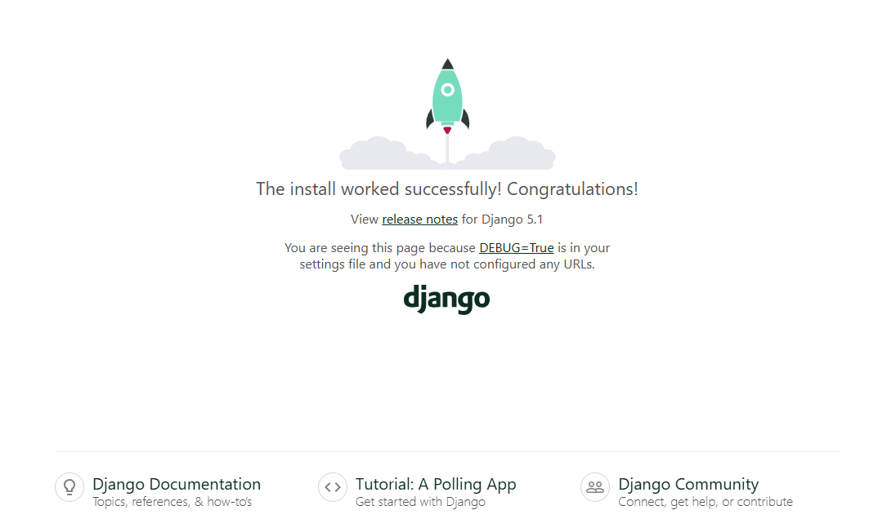

# Poetry

**(also provided Traditional Chinese version document [README-CH.md](README-CH.md).)**

Poetry is a Python dependency and package management tool that simplifies project dependency management, virtual environments, and version control.
This project demonstrates how to create a virtual environment with Poetry, install Django, and start a simple Django development server.

## Overview

- Language: Python 3.12.3
- Dependency Management: Poetry v1.8.3
- Web Framework: Django v5.1.3


## Steps

### Initialize Poetry
To initialize a new Poetry project, run the following command:
```bash
poetry init
```

You will be prompted with the following questions. Answer accordingly to configure your `pyproject.toml` file:
```
This command will guide you through creating your pyproject.toml config.

Package name [poetry-python]: 
Version [0.1.0]:  
Description []:  
Author [yuhexiong <yuhexiong871210@gmail.com>, n to skip]:  
License []:  
Compatible Python versions [^3.12]:  

Would you like to define your main dependencies interactively? (yes/no) [yes] yes
You can specify a package in the following forms:
  - A single name (requests): this will search for matches on PyPI
  - A name and a constraint (requests@^2.23.0)
  - A git url (git+https://github.com/python-poetry/poetry.git)
  - A git url with a revision (git+https://github.com/python-poetry/poetry.git#develop)
  - A file path (../my-package/my-package.whl)
  - A directory (../my-package/)
  - A url (https://example.com/packages/my-package-0.1.0.tar.gz)

Package to add or search for (leave blank to skip):

Would you like to define your development dependencies interactively? (yes/no) [yes] no
Generated file

[tool.poetry]
name = "poetry-python"
version = "0.1.0"
description = ""
authors = ["yuhexiong <yuhexiong871210@gmail.com>"]
readme = "README.md"

[tool.poetry.dependencies]
python = "^3.12"

[build-system]
requires = ["poetry-core"]
build-backend = "poetry.core.masonry.api"

Do you confirm generation? (yes/no) [yes] yes
```

After this, your `pyproject.toml` file will be generated.

### Set up Python Environment

Set up the virtual environment and specify the Python version for your project:

```bash
poetry config virtualenvs.in-project true 
poetry env use python
```
The `poetry env use` command should be followed by the path or version of the Python installed on your system.

This will create a `.venv` folder inside your project directory.

### Install Modules

To add Django to your project:

```bash
poetry add django
```

### Create a Django Project

To create a new Django project:

```bash
poetry run django-admin startproject poetry_django_api .
```

To create a new Django app:

```bash
poetry run python manage.py startapp poetry_django_app
```

### Project Structure

The resulting project structure will look like this:

```
poetry_django_api/                 # Django project directory
├── .venv/                         # Virtual environment directory
├── poetry_django_api/             # Main Django project directory
│   ├── __init__.py                # Initialization file
│   ├── asgi.py                    # ASGI configuration
│   ├── settings.py                # Settings file
│   ├── urls.py                    # URL configuration
│   └── wsgi.py                    # WSGI configuration
├── poetry_django_app/             # Added application (app) directory
│   ├── migrations/                # Migration files
│   ├── __init__.py                # Initialization file
│   ├── admin.py                   # Django admin settings
│   ├── apps.py                    # Application configuration
│   ├── models.py                  # Data models
│   ├── tests.py                   # Test files
│   └── views.py                   # Views file
├── manage.py                      # Main entry point
├── poetry                         # Poetry configuration
├── poetry.lock                    # Poetry lock file (dependency versions)
└── pyproject.toml                 # Poetry configuration file
```

### Dry Run

To run the Django server locally (dry run):

```bash
poetry run python manage.py runserver
```

You should be able to access your Django project at `localhost:8000`.



This completes the setup and allows you to develop your Django application with Poetry for dependency management.
